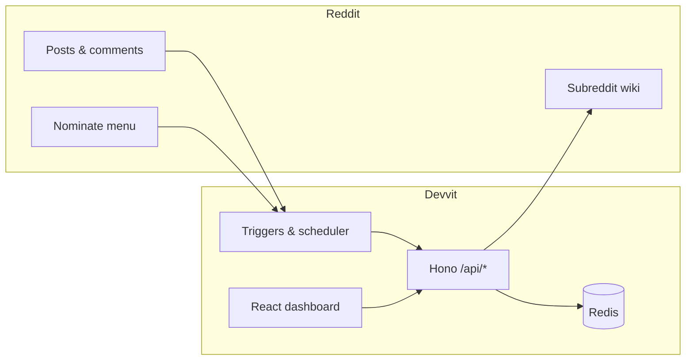

# modscribe

**A living wiki co-pilot for Reddit moderators.**

modscribe watches your subreddit, surfaces high-signal posts and comments on a moderator **Desk**, helps you **categorize** content into taxonomy-backed **encyclopedia articles**, and generates **reviewable Markdown drafts** for your subreddit wiki. Nothing publishes without an explicit mod action.

Built on [Reddit Devvit Web](https://developers.reddit.com/) — React 19, Hono, Redis, and optional OpenAI / Google Gemini generation.

---

## Why modscribe exists

Most subreddit wikis decay because maintenance is manual: find the thread, summarize it, paste into a page, repeat. modscribe flips the workflow:

| Old habit | modscribe |
|-----------|-----------|
| One post → one wiki stub | Many sources → **one article** |
| Draft first, organize later | **Categorize first**, then generate |
| Delete or lose low-signal threads | **Archive** with reasons (searchable later) |
| Hope mods notice good posts | **Watch** + **discover** + optional **scheduled scans** |
| Merge duplicate pages by hand | **Merge / split proposals** when autonomy is high |

**Product rule:** automate discovery and drafting; keep publication under moderator control.

---

## Features

### Desk (moderator inbox)

- Unified triage: pending sources, categorization, preview, draft generation
- Pick **taxonomy path** and **target article** before generating
- Desktop three-pane layout; mobile list/detail with swipe-to-archive sheet
- Sources from **watch**, **nominate** menu action, **discover** backfill, or manual mod ingest

### Wiki

- **Articles** grouped by taxonomy (many `sourceIds` per page)
- Draft revisions with AI-assisted encyclopedia-style Markdown
- Publish to native subreddit wiki (with diff context when a page already exists)
- Approve **merge** or **split** structure proposals (autonomy: `restructure`)

### Archive

- Clear desk items without publishing (off-topic, duplicate, spam, not wiki material)
- Full-text **search** and filter by archive reason

### Automation

| Mode | Behavior |
|------|----------|
| **Watch** | Ingest new posts/comments above min score (keyword + flair filters) |
| **Discover** | Scan top / hot / best / new listings for existing high-signal posts |
| **Scheduled discover** | Cron every 12 hours when enabled |
| **Autonomy dial** | `suggest` → `categorize` → `draft` → `restructure` (merge/split proposals) |

Dashboard **toggles** for watch / discover / schedule override install settings per subreddit; use **Reset to install settings** to clear overrides.

### AI providers

- **Mock** (offline template) for development
- **OpenAI** or **Google Gemini** with API key validated on save
- Multi-source prompts include prior snapshots attached to the target article

---

## Architecture



**Stack**

- **Client:** React 19, Tailwind CSS 4, Vite (`splash.html` inline + `game.html` expanded)
- **Server:** Node 22, Hono, `@devvit/web/server`
- **Storage:** Redis (per-record keys + sorted indexes)
- **API:** REST under `/api/*` (moderator-gated)

**Key server modules**

| Path | Role |
|------|------|
| `src/server/core/ingest.ts` | Watch/discover filters, inbox, proposals |
| `src/server/core/generator.ts` | AI / mock draft generation |
| `src/server/core/publish.ts` | Wiki publish adapter |
| `src/server/core/merge.ts` / `split.ts` | Structure proposal execution |
| `src/server/core/discover.ts` | Listing scans |
| `src/server/core/runtimeSettings.ts` | Dashboard setting overrides |

---

## Quick start

### Prerequisites

- **Node.js ≥ 22**
- [Devvit CLI](https://developers.reddit.com/docs/guides/tools/devvit_cli) and a Reddit developer account
- A test subreddit (this repo defaults playtest to `r/modscribe_dev` in `devvit.json`)

### Install & playtest

```bash
git clone https://github.com/YOUR_ORG/modscribe.git
cd modscribe
npm install
npm run login
npm run dev
```

`npm run dev` runs `devvit playtest` — install the app on your test sub and open the expanded view from the post.

### Verify locally

```bash
npm run type-check
npm run test
npm run lint
```

### Deploy

```bash
npm run build
npm run deploy    # type-check + lint + test + devvit upload
npm run launch    # deploy + publish (when ready)
```

After changing `devvit.json` (triggers, scheduler, settings), **upload and upgrade** the installation on your subreddit so new tasks and settings appear.

---

## Configuration

Install settings live in **Mod Tools → Apps → modscribe → Settings**.

| Setting | Purpose |
|---------|---------|
| Watch mode | Auto-ingest new posts/comments |
| Discover existing posts | Backfill from subreddit listings |
| Discover listing / timeframe / batch size | What to scan |
| Scheduled discover scans | Cron every 12h |
| Min score threshold | Floor for watch/discover |
| Target flairs | Only ingest posts with these flairs (empty = all) |
| Ignored keywords | Skip posts/comments containing these |
| Autonomy dial | How much runs without a mod |
| AI provider + API key | OpenAI, Gemini, or mock |

**In-app overrides** (Settings tab): watch, discover, and schedule toggles can differ from install defaults until you click **Reset to install settings**.

---

## Moderator workflows

1. **Nominate** — Mod menu on a post/comment → “Nominate for Wiki”
2. **Triage** — Desk → categorize → generate draft → edit → publish
3. **Archive** — Swipe or button; item moves to Archive tab (searchable)
4. **Backfill** — Settings → Discover posts now (or enable scheduled discover)
5. **Restructure** — Set autonomy to *Propose restructure* → review merge/split on Wiki tab

---

## Project layout

```text
src/
  client/          # React UI (Desk, Wiki, Archive, Settings)
  server/          # Hono app, triggers, scheduler, core logic
  shared/          # Types & constants (client + server safe)
devvit.json        # App manifest, triggers, scheduler, install settings
docs/              # Product spec, architecture, implementation plan
```

---

## Documentation

| Doc | Contents |
|-----|----------|
| [docs/implementation_plan.md](docs/implementation_plan.md) | Living wiki roadmap & phases |
| [docs/PRODUCT_SPEC.md](docs/PRODUCT_SPEC.md) | Product requirements |
| [docs/ARCHITECTURE.md](docs/ARCHITECTURE.md) | System design notes |
| [docs/DEVVIT_IMPLEMENTATION_NOTES.md](docs/DEVVIT_IMPLEMENTATION_NOTES.md) | Devvit-specific pitfalls |
| [AGENTS.md](AGENTS.md) | Conventions for AI assistants in this repo |

---

## Safety & non-goals

- No silent auto-publish to the public wiki
- No unlimited scraping; discover runs are bounded batches
- Public Markdown excludes moderator notes by default
- Jokes, speculation, and accusations should not be presented as fact in generated copy

**Deferred / future:** custom per-sub taxonomy editor, comment-tree ingestion, LLM categorization, rich media infoboxes, off-platform hosting.

---

## Contributing

1. Branch from `main`
2. `npm run type-check && npm run test`
3. Open a PR with a short test plan (Desk / Wiki / Settings paths touched)

---

## License

BSD-3-Clause — see [package.json](package.json).
